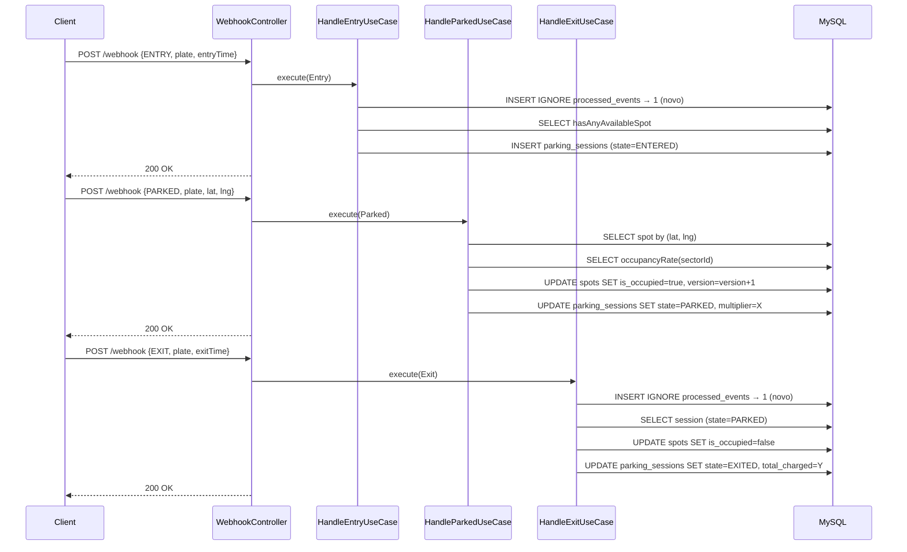
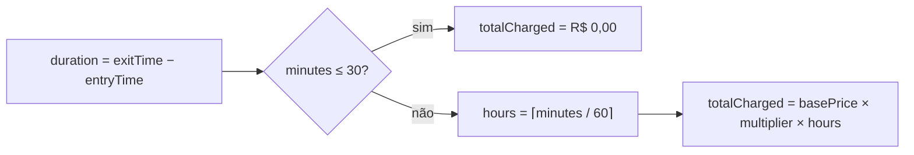

# Estapar Parking API

Backend de gerenciamento de estacionamento — desafio técnico Estapar.

## Stack

| Camada | Tecnologia |
|---|---|
| Runtime | Java 21 · Virtual Threads |
| Framework | Spring Boot 3.4.5 |
| Persistência | Spring Data JPA · Flyway · MySQL 8 |
| Qualidade | ktlint · detekt · ArchUnit |
| Testes | JUnit 5 · MockK · Kotest · Testcontainers |
| Observabilidade | Micrometer · Prometheus · Actuator |
| Docs | SpringDoc OpenAPI (Swagger UI) |
| CI/CD | GitHub Actions · Docker Hub · Render |

---

## Arquitetura

O projeto segue **Hexagonal Architecture** com **DDD Lite** e **Vertical Slicing** por bounded context.

```
src/main/kotlin/com/estapar/parking/
├── garage/               ← Bounded context: configuração do garagem
│   ├── domain/
│   ├── application/port/
│   └── infrastructure/
├── parkingsession/       ← Bounded context: sessões, billing, eventos
│   ├── domain/
│   ├── application/
│   └── infrastructure/
└── shared/               ← Clock, erros, métricas, config
```

A regra de dependência é verificada automaticamente por ArchUnit em cada build:

- `domain` → não pode importar Spring, JPA, Jackson ou Hibernate
- `application` → não pode importar `infrastructure`

### Diagrama de camadas

```mermaid
graph LR
    subgraph infra["Infrastructure (adapters)"]
        WC[WebhookController]
        RC[RevenueController]
        PSA[ParkingSessionRepositoryAdapter]
        GRA[GarageRepositoryAdapter]
        GCC[GarageConfigRestClient]
    end

    subgraph app["Application (use cases)"]
        HE[HandleEntryUseCase]
        HP[HandleParkedUseCase]
        HX[HandleExitUseCase]
        GR[GetRevenueUseCase]
        BC[BillingCalculator]
    end

    subgraph domain["Domain"]
        PS[ParkingSession]
        SS[SessionState]
        LP[LicensePlate]
        OR[OccupancyRate]
        SL[SpotLocation]
    end

    infra -->|drives| app
    app -->|uses| domain
    infra -.->|implements ports| app
```



### Fluxo de eventos webhook (sequência)



### Fórmula de billing



### Multiplicador de preço (OccupancyRate)

| Ocupação do setor | Multiplicador |
|---|---|
| < 25% | 0,90 |
| 25% – 49% | 1,00 |
| 50% – 74% | 1,10 |
| ≥ 75% | 1,25 |

---

## Como executar localmente

### Pré-requisitos

- Java 21+
- Docker + Docker Compose

### 1. Subir infraestrutura

```bash
docker-compose up -d
```

Sobe: MySQL 8 (porta 3306) e o simulador de garagem `cfontes0estapar/garage-sim:1.0.0` (porta 3000).

### 2. Rodar a aplicação

```bash
./gradlew bootRun
```

A aplicação inicia na porta **3003** e, no primeiro boot, busca a configuração da garagem no simulador (`GET http://localhost:3000/garage`) e popula o banco.

### 3. Endpoints disponíveis

| Método | Path | Descrição |
|---|---|---|
| `POST` | `/webhook` | Recebe eventos ENTRY, PARKED e EXIT |
| `GET` | `/revenue` | Retorna receita total de sessões encerradas |
| `GET` | `/actuator/health` | Health check |
| `GET` | `/actuator/prometheus` | Métricas no formato Prometheus |
| `GET` | `/swagger-ui.html` | Documentação interativa da API |
| `GET` | `/v3/api-docs` | Especificação OpenAPI 3.0 |

### Exemplo de uso

```bash
# ENTRY
curl -s -X POST http://localhost:3003/webhook \
  -H "Content-Type: application/json" \
  -d '{"license_plate":"ZUL0001","event_type":"ENTRY","entry_time":"2025-01-01T12:00:00.000Z"}'

# PARKED
curl -s -X POST http://localhost:3003/webhook \
  -H "Content-Type: application/json" \
  -d '{"license_plate":"ZUL0001","event_type":"PARKED","lat":-23.561684,"lng":-46.655981}'

# EXIT
curl -s -X POST http://localhost:3003/webhook \
  -H "Content-Type: application/json" \
  -d '{"license_plate":"ZUL0001","event_type":"EXIT","exit_time":"2025-01-01T14:00:00.000Z"}'

# Receita total
curl -s http://localhost:3003/revenue
```

### 4. Testes

```bash
./gradlew test          # roda todos os testes
./gradlew build         # build completo: ktlint + detekt + ArchUnit + testes
```

---

## ADRs (Architecture Decision Records)

### ADR-001 — Idempotência via INSERT IGNORE

**Contexto:** Webhooks podem ser reenviados pelo simulador. Processar o mesmo evento duas vezes criaria sessões duplicadas ou estados inválidos.

**Decisão:** Tabela `processed_events` com constraint única em `(license_plate, event_type, event_timestamp)`. Uso de `INSERT IGNORE` nativo, que retorna 0 em caso de duplicata sem lançar exceção, mantendo a transação do use case intacta.

**Consequência:** A inserção corre na mesma transação externa. Se o use case falhar posteriormente (ex.: garagem cheia), a linha de `processed_events` também é revertida, permitindo nova tentativa.

---

### ADR-002 — Multiplicador congelado no momento do PARKED

**Contexto:** A ocupação do setor muda continuamente. Cobrar com base na ocupação no momento da saída seria imprevisível para o motorista.

**Decisão:** O `pricingMultiplier` é calculado no instante em que o evento PARKED é processado e gravado na coluna `parking_sessions.pricing_multiplier`. Todos os cálculos de billing usam esse valor fixo.

**Consequência:** O preço por hora é determinístico e auditável. Uma mudança de ocupação após o estacionamento não afeta o valor cobrado.

---

### ADR-003 — Validações de capacidade por evento

**Contexto:** O sistema deve rejeitar entradas quando não há vagas disponíveis e estacionamentos quando o setor específico está cheio.

**Decisão:**
- **ENTRY** verifica `hasAnyAvailableSpot()` → 503 Service Unavailable se a garagem inteira está cheia
- **PARKED** verifica `occupancyRateOf(sectorId).isFull()` → 409 Conflict se o setor está cheio

**Consequência:** Códigos HTTP semânticos distintos permitem que o cliente diferencie "garagem cheia" de "setor deste slot está cheio".

---

### ADR-004 — Billing: carência de 30 minutos, cobrança em horas cheias

**Contexto:** Definir a regra de negócio central de tarifação.

**Decisão:**
```
se (minutos ≤ 30) → R$ 0,00
senão → ⌈minutos / 60⌉ × basePrice × multiplier
```

**Consequência:** Um carro que fica 31 minutos paga 1 hora cheia. Um carro que fica 61 minutos paga 2 horas. O resultado é sempre arredondado para 2 casas decimais com `HALF_UP`.

---

### ADR-005 — Lookup de vaga por coordenadas com tolerância épsilon

**Contexto:** Coordenadas GPS têm imprecisão de ponto flutuante. Comparação exata nunca funcionaria.

**Decisão:** `SpotLocation.equals` usa `|lat1 - lat2| < 1e-6` e `|lng1 - lng2| < 1e-6` (tolerância ≈ 11 cm). O índice `idx_spots_location(lat, lng)` no banco usa comparação exata para filtro inicial; a tolerância é aplicada em memória pelo `GarageRepositoryAdapter`.

**Consequência:** Coordenadas reportadas pelo simulador que diferem em menos de 11 cm do valor cadastrado são aceitas. Coordenadas fora da tolerância retornam 404.

---

### ADR-006 — Locking otimista no Spot com retry automático

**Contexto:** Em alta carga, dois eventos PARKED para carros diferentes podem tentar marcar a mesma vaga como ocupada simultaneamente.

**Decisão:** `@Version` na entidade `SpotJpaEntity` (coluna `version`). `HandleParkedUseCase` usa `@Retryable(ObjectOptimisticLockingFailureException, maxAttempts=3, backoff=50ms)`. Após 3 falhas, o `GlobalExceptionHandler` retorna 409.

**Consequência:** Até 3 tentativas automáticas com backoff de 50 ms. Contention real (> 3 conflitos simultâneos) resulta em 409, que o cliente pode retentar. Evita locks pesados de banco.

---

## Decisões de trade-off

| Decisão | Alternativa descartada | Motivo da escolha |
|---|---|---|
| `INSERT IGNORE` em vez de `REQUIRES_NEW` + catch | `REQUIRES_NEW` — Hibernate marca a sessão como rollback-only mesmo com catch, vazando `UnexpectedRollbackException` para a transação externa | `INSERT IGNORE` resolve em uma instrução SQL sem envolver o gerenciador de transações Java |
| `application-test.yml` apontando para MySQL real | Testcontainers JDBC URL (`jdbc:tc:mysql:...`) | Docker Desktop 4.34+ rejeita API version 1.41 do docker-java com status 400; MySQL já está disponível via docker-compose |
| Sealed class para `SessionState` | Coluna `state` enum no banco + switch | Estados com dados diferentes (ex.: `Exited` tem `totalCharged`, `Entered` não) ficam type-safe sem casts inseguros |
| `object` para `BillingCalculator` | Interface + impl com Spring bean | Função pura sem dependências — `object` é mais legível e testável sem contexto Spring |
| `OccupancyRate` como value object validado | Validação inline no use case | Centraliza a lógica de multiplicador e `isFull()` em um lugar, facilita testes unitários puros |
| Virtual threads (`spring.threads.virtual.enabled=true`) | Thread pool tradicional | Carga do simulador é I/O-bound (JDBC + HTTP); virtual threads eliminam overhead de thread pool sem mudança de código |

---

## CI/CD

O pipeline no GitHub Actions (`/.github/workflows/ci.yml`) tem três jobs:

```
push to main
    │
    ├── build  → MySQL service + ./gradlew build (ktlint · detekt · ArchUnit · 48 testes)
    │
    ├── docker → bootJar → docker build & push (Docker Hub)
    │
    └── deploy → curl RENDER_DEPLOY_HOOK
```

### Secrets necessários no repositório GitHub

| Secret | Descrição |
|---|---|
| `DOCKERHUB_USERNAME` | Usuário Docker Hub |
| `DOCKERHUB_TOKEN` | Access token Docker Hub |
| `RENDER_DEPLOY_HOOK` | Deploy hook URL do serviço no Render |

### Deploy no Render

1. Criar serviço **Web Service** → Docker → apontar para o repositório
2. Configurar as variáveis de ambiente (ver `render.yaml`):
   - `SPRING_DATASOURCE_URL` → JDBC URL do MySQL externo (ex.: PlanetScale)
   - `SPRING_DATASOURCE_USERNAME` e `SPRING_DATASOURCE_PASSWORD`
3. O deploy é acionado automaticamente pelo webhook após cada push para `main`

---

## Estrutura de testes

| Tipo | Classe | Cobertura |
|---|---|---|
| Arquitetura | `HexagonalArchitectureTest` | 6 regras ArchUnit |
| Domínio | `OccupancyRateTest` | 9 casos paramétricos |
| Billing | `BillingCalculatorTest` | 10 durações × 4 multiplicadores |
| Use cases | `HandleEntryUseCaseTest`, `HandleParkedUseCaseTest`, `HandleExitUseCaseTest` | MockK puro, sem Spring |
| Métricas | `ParkingMetricsTest` | SimpleMeterRegistry |
| REST client | `GarageConfigRestClientTest` | WireMock standalone |
| Integração | `WebhookIntegrationTest` | `@SpringBootTest` + MySQL real — ciclo completo ENTRY→PARKED→EXIT + idempotência |
